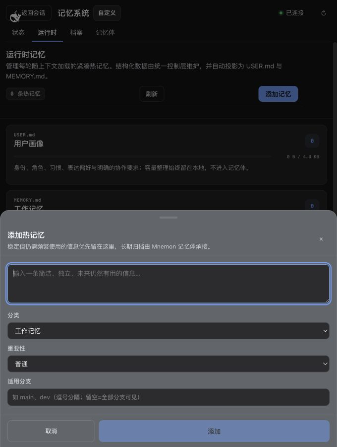
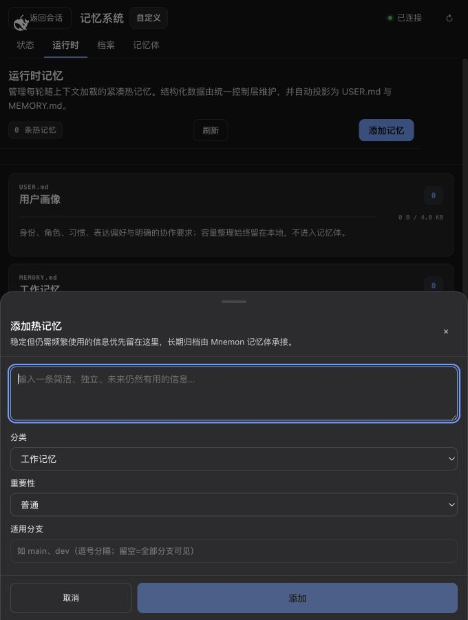
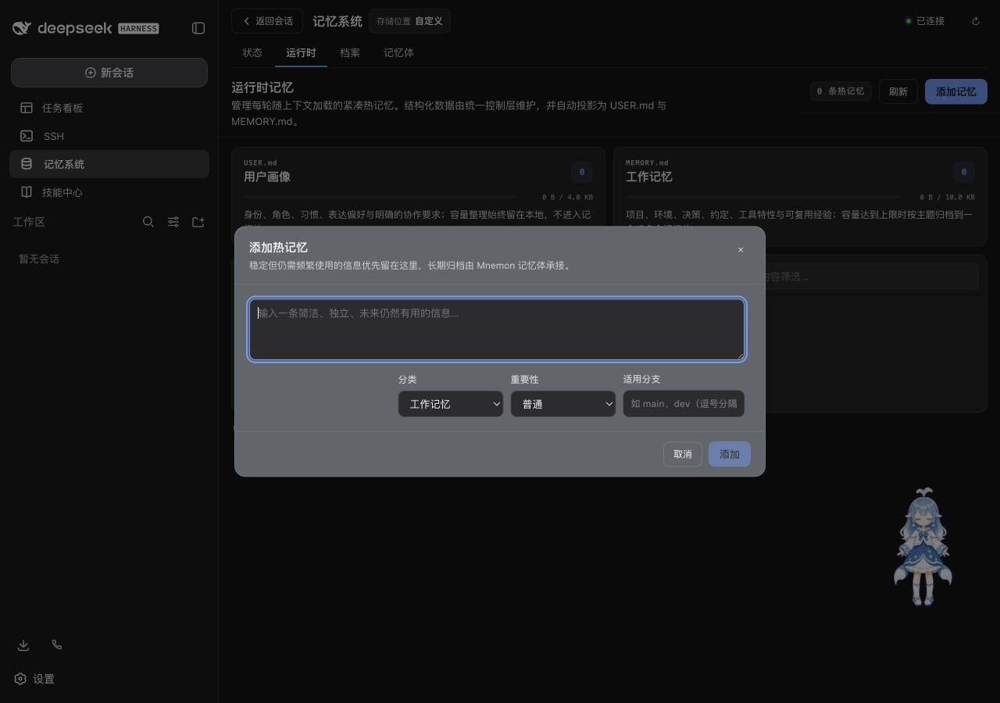
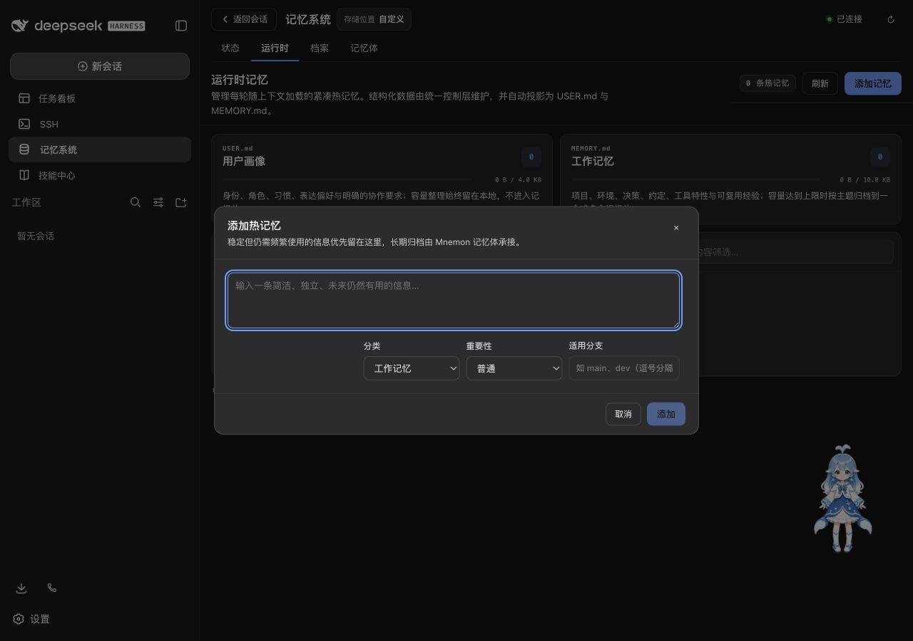
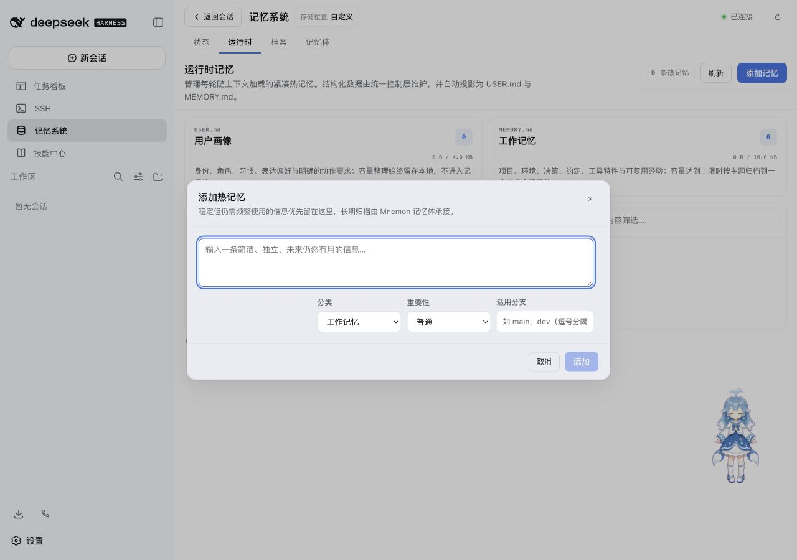
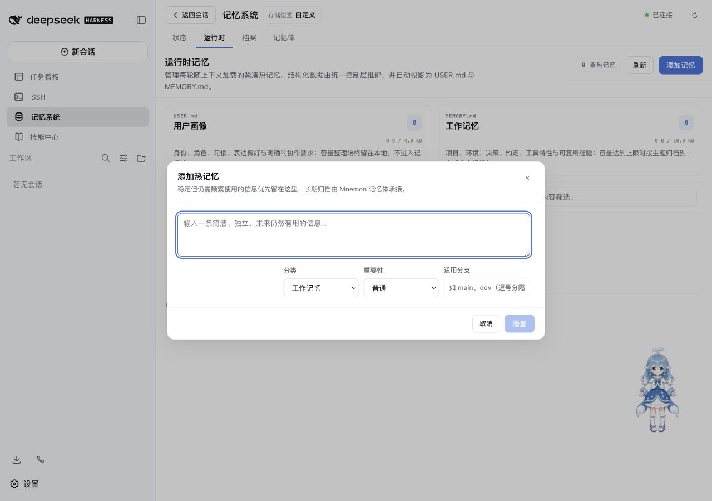
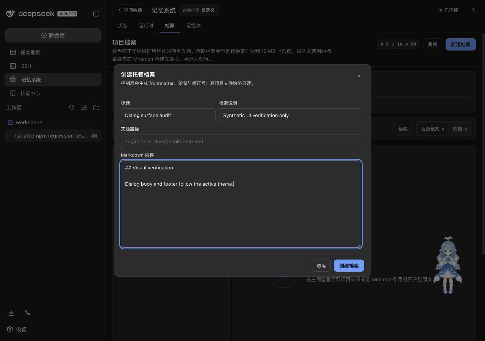
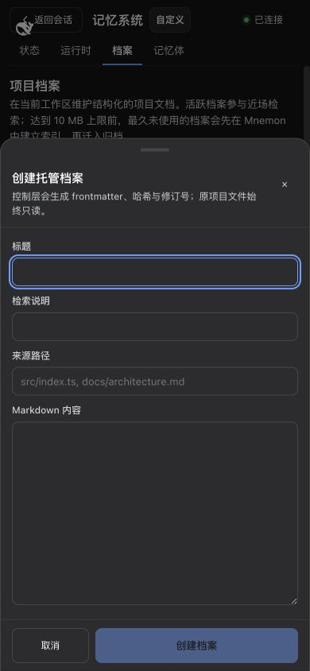
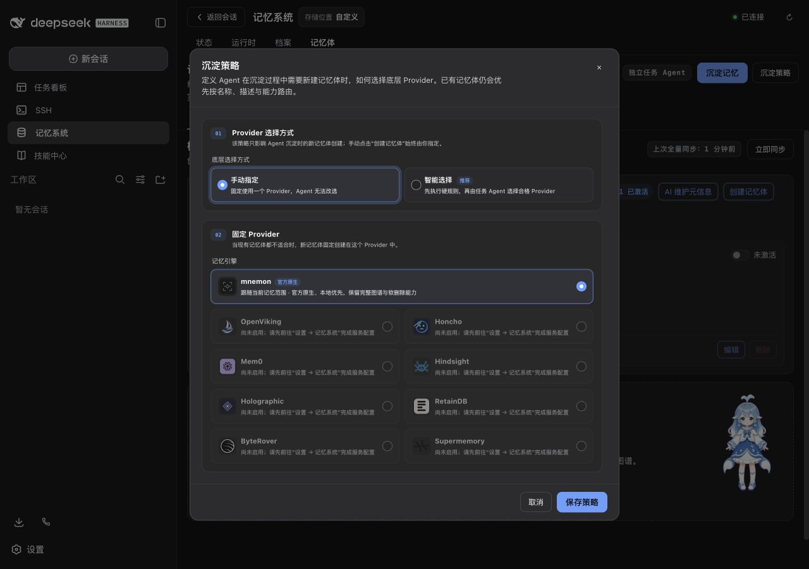

# 弹窗背景回归证据 / Dialog surface regression evidence

本目录是本次修复的 PR 验证材料，不替换发布截图。基线为 `540630e`，验证于 2026-08-30 至 2026-08-31。修复后构建仅修改两个 Client CSS 文件；[measurements.json](./measurements.json) 保存源码 SHA-256、浏览器观测值与像素检查结果。

These are PR regression artifacts, not replacement release screenshots. The baseline is `540630e`, verified on August 30–31, 2026. The patched build changes only two Client CSS files; [measurements.json](./measurements.json) records their SHA-256 hashes, browser observations, and pixel checks.

## 原因与修复 / Cause and fix

侧栏弹窗和页脚直接使用 `--dsw-alias-bg-overlay`，而宿主原生 Modal 使用 `--dsw-alias-bg-layer-2`。前者在默认深色主题中是明显偏亮的灰色。共用弹窗还缺少透明皮肤所需的画布底层。

Sidebar dialogs and footers used `--dsw-alias-bg-overlay`, whereas the host's native Modal uses `--dsw-alias-bg-layer-2`. The former produces the conspicuously bright gray in the default dark theme. The shared dialog also lacked a canvas backing for translucent skins.

| 默认主题 / Default theme | 修复前侧栏 / Sidebar before | 修复后及原生 Modal / After and native Modal |
| --- | --- | --- |
| 深色 / Dark | `#61666b` | `#2c2c2e` |
| 浅色 / Light | `#e9ecf2` | `#ffffff` |

共用弹窗现在将 layer-2 叠加在已有 `--mn-surface` 画布上，侧栏不再覆盖它，页脚保持透明以避免重复叠色。Portal、焦点、动画、滚动、移动端抽屉及所有写入行为不变。会话内“存入记忆”本来就使用原生 Modal，已核对且未修改；页面画布和 Tooltip 的合法主题色也未修改。

The shared dialog now paints layer-2 over the existing `--mn-surface` canvas. Sidebar overrides are removed, and the footer stays transparent to avoid compositing the same translucent fill twice. Portals, focus, animation, scrolling, mobile sheets, and write behavior are unchanged. Conversation Save to memory already uses the native Modal and was checked without modification; legitimate canvas and Tooltip theme colors are unchanged too.

## 实机截图 / Live screenshots

截图来自独立 worktree 的真实 npm WebUI：DSH `0.1.1-rc.2`、`@linxin666/dsh-web-all@0.3.6`、Mnemon `0.3.5` 加本补丁。使用隔离的 home、workspace、记忆目录与本机固定模型响应，仅包含合成数据；未连接私人记忆或付费模型服务。前后运行时弹窗使用相同的空数据状态。

Screenshots come from the real npm WebUI in an independent worktree: DSH `0.1.1-rc.2`, `@linxin666/dsh-web-all@0.3.6`, and Mnemon `0.3.5` plus this patch. Home, workspace, memory storage, and the local fixed model response are isolated; all data is synthetic, with no private memory or paid model service connected. Runtime before/after pairs use the same empty data state.

| 场景 / Scenario | 修复前 / Before | 修复后 / After |
| --- | --- | --- |
| 深色移动端添加热记忆 / Dark mobile runtime, 680 × 900 |  |  |
| 深色桌面添加热记忆 / Dark desktop runtime, 1280 × 900 |  |  |
| 浅色桌面添加热记忆 / Light desktop runtime, 1280 × 900 |  |  |

其他修复后截图 / Additional patched screenshots:

| 创建档案桌面 / Desktop document creation, 1280 × 900 | 创建档案窄屏 / Narrow document creation, 390 × 844 | 沉淀策略 / Persistence strategy, 1280 × 900 |
| --- | --- | --- |
|  |  |  |

## 排查范围 / Audit coverage

真实页面逐一打开全部 15 个 `SidebarModal` 调用入口，记录计算样式并检查横向溢出；另核对一个原生会话弹窗。共保留 23 次观测，含主题和视口的重复验证。破坏性确认仅打开后取消，没有执行删除、遗忘、归档或版本更新。

All 15 `SidebarModal` call sites were opened in the live UI, with computed styles and horizontal overflow checked. One native conversation dialog was checked separately. The 23 observations include repeated theme/viewport checks. Destructive confirmations were opened and canceled; deletion, forgetting, archiving, and version updates were not executed.

| 区域 / Area | 已打开入口 / Opened dialogs | 数量 / Count |
| --- | --- | --- |
| 运行时记忆 / Runtime memory | 添加、编辑、移除确认 / Add, edit, remove confirmation | 3 |
| 记忆体 / Memory spaces | 创建、编辑、删除确认 / Create, edit, delete confirmation | 3 |
| 记忆维护 / Memory maintenance | AI 元信息、沉淀策略、沉淀记忆 / AI metadata, persistence strategy, supervised write | 3 |
| 项目档案 / Project documents | 创建、编辑、归档确认 / Create, edit, archive confirmation | 3 |
| 其他 / Other | 版本检查、遗忘确认、全文预览 / Version check, forget confirmation, full-content preview | 3 |

外部 Provider 的“断开连接”与已验证的删除确认共用同一入口和样式；未单独配置远程 Provider。`buildin` 与侧栏的共用样式通过下面的渲染实验验证，不声称逐一测试所有第三方皮肤。

External Provider disconnect shares the tested deletion call site and styles; no remote Provider was provisioned separately. Shared styles for `buildin` and sidebar surfaces were also checked by the rendering experiment below; this is not a claim that every third-party skin was tested.

## 渲染与工程验证 / Rendering and engineering validation

本地临时浏览器夹具使用基线和修复后的真实 CSS Modules，分别渲染侧栏与 `buildin` 弹窗。背景使用彩色棋盘以暴露穿透，并对主体、页脚分别采样。8 种 token 组合覆盖默认明暗、透明层、半透明层、半透明画布及缺少 overlay token；32 个采样点修复前 10 个符合预期，修复后 32 个全部符合预期。JPEG 每通道容差为 3。此项是本次手动视觉回归实验，不是新增 CI 测试。

A temporary local browser fixture rendered the actual baseline and patched CSS Modules for sidebar and `buildin` dialogs. A colored checkerboard exposed bleed-through, with body and footer pixels sampled separately. Eight token combinations cover default light/dark, transparent layers, translucent layers, a translucent canvas, and a missing overlay token. Of 32 samples, 10 matched before and all 32 matched after, allowing a JPEG tolerance of 3 per channel. This is a manual visual regression experiment for this change, not a new CI test.

| 检查 / Check | 结果 / Result |
| --- | --- |
| `pnpm run verify` | 通过 / Passed |
| Vitest | 541 通过，1 个 Windows 专用测试在 macOS 跳过 / 541 passed; 1 Windows-only test skipped on macOS |
| 确定性构建 / Deterministic build | 106 个文件一致 / 106 matching files |
| Headless 激活 / Headless activation | 35 个工具，核对 5 个 Mnemon 代表工具 / 35 tools; 5 representative Mnemon tools asserted |
| 包与入口 / Package and entry checks | 内容检查、10 个 Node 入口、publint 与 attw 通过 / Contents, 10 Node entries, publint, and attw passed |
| 浏览器 / Browser | 15 个共用弹窗无横向溢出，控制台无错误 / No horizontal overflow in the 15 shared dialogs; no console errors |
| `git diff --check` | 通过 / Passed |

复核时可运行 `pnpm run verify`，再用 `node scripts/serve-web-regression.mjs --cli <test-owned-mnemon-binary>` 启动隔离 WebUI，切换官方明暗主题并按上表打开弹窗。工作流、文案、配置和存储契约未变，因此现有中英文使用指南无需改写。

To recheck, run `pnpm run verify`, then start the isolated WebUI with `node scripts/serve-web-regression.mjs --cli <test-owned-mnemon-binary>`, select the official light/dark themes, and open the dialogs listed above. Workflows, copy, configuration, and storage contracts are unchanged, so the existing English and Chinese usage guides need no revision.
